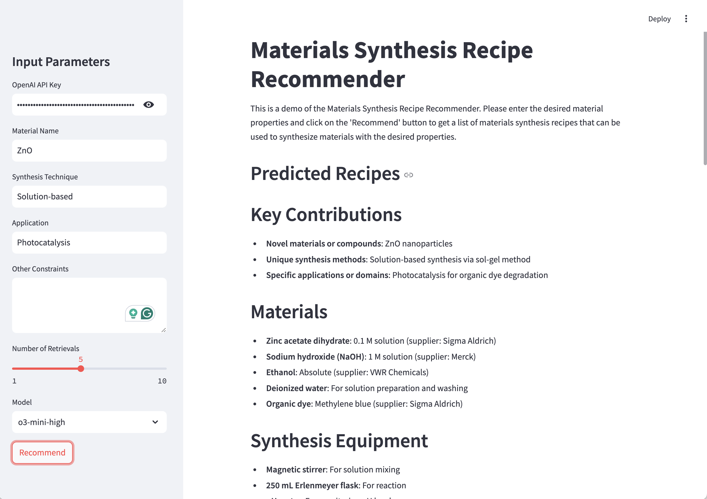
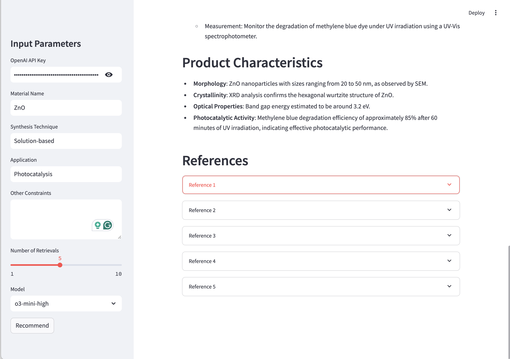

# AlchemyBench: Materials Synthesis Benchmark

This repository contains the source code and scripts used in the paper **"Dataset and Expert-Level LLM-as-a-Judge for Materials Synthesis"**. The repository includes tools for data preprocessing, model training, evaluation, and benchmarking.

## Introduction
AlchemyBench is a benchmark designed to evaluate the performance of large language models (LLMs) in materials synthesis prediction tasks. It includes:
1. A dataset of 17K expert-verified synthesis recipes.
2. Tasks such as raw materials prediction, synthesis procedure generation, and characterization outcome forecasting.
3. An LLM-as-a-Judge framework for automated evaluation.

For more details, refer to our paper: [paper](https://arxiv.org/abs/2502.16457), [dataset](https://huggingface.co/datasets/iknow-lab/open-materials-guide-2024)

## Features
- **Dataset Processing**: Scripts to preprocess the Open Materials Guide (OMG) dataset.
- **Evaluation Framework**: Implementation of the LLM-as-a-Judge evaluation system.
- **Retrieval-Augmented Generation (RAG)**: Integration of retrieval-based methods for improved synthesis prediction.

## Usage
Use python=3.11 and install the required packages using the following command:
```
pip install -r requirements.txt
```

### Streamlit Demo
Try our [online streamlit demo](https://materials-recipe.streamlit.app/) or run in your evironment to predict the synthesis recipe.
```
export OPENAI_API_KEY= # your api key here
streamlit run demo.py
```
<details>
<summary>Screenshots</summary>
<div markdown="1">




</div>
</details>

### Repository Structure
```
data_collection/
- Code for retrieving articles from Semantic Scholar API (retrieve_s2api.py)
- Download the PDFs of the articles (download_paper.py)
- Code for converting PDFs to markdowns (pdf2md.py)
- Code for classifying and extracting recipes from markdowns (classify.py and extract_recipe.py)

experiment/
- Code for predicting recipes using the Open Materials Guide (OMG) dataset (predict_recipe.py)
- Code for evaluating the performance of the model using LLM-as-a-Judge (evaluate.py)
```


If you use our work in your research, please cite our paper:
```
@misc{kim2025fullyautomatedmaterialsdiscoverylargescale,
      title={Towards Fully-Automated Materials Discovery via Large-Scale Synthesis Dataset and Expert-Level LLM-as-a-Judge}, 
      author={Heegyu Kim and Taeyang Jeon and Seungtaek Choi and Jihoon Hong and Dongwon Jeon and Sungbum Cho and Ga-Yeon Baek and Kyung-Won Kwak and Dong-Hee Lee and Sun-Jin Choi and Jisu Bae and Chihoon Lee and Yunseo Kim and Jinsung Park and Hyunsouk Cho},
      year={2025},
      eprint={2502.16457},
      archivePrefix={arXiv},
      primaryClass={cs.CL},
      url={https://arxiv.org/abs/2502.16457}, 
}
```


## License
This project is licensed under the MIT License. See the `LICENSE` file for details.

